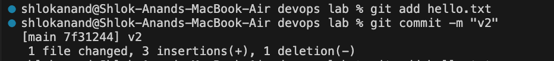
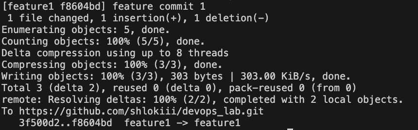

# devops_lab
# DEVOPS LAB
## LAB-1 GIT COMMANDS

### 1. Clone the repository:
```sh
git clone https://github.com/shlokiii/devops_lab.git
```


### 2. Adding image:
```sh 
git add .
git commit -m "my first commit with image"
git push
```


### 3. Git status and Diff Commands:
```sh 
git staus
```


```sh
git diff
```


## LAB-2 GIT COMMANDS
### 1. Checking the logs
### version1:
```sh
git add hello.txt
git commit -m "v1"      
```


### version2:
```sh
git add hello.txt
git commit -m "v2"      
```


### version3:
```sh
git add hello.txt
git commit -m "v3"      
```


```sh
git log
```


### 2. Creating branch and merging with Main
```sh
git branch feature1
git add .
git commit -m "feature commit 1"
git push origin feature1
```


### Merged with Main
```sh
git add README.md
git commit -m "Updated README before merging"


git checkout main
git merge feature1 -m "Merging feature1"
```


## Lab-3. SUBVERSION
### Installation of Subversion (SVN) using Homebrew:
``` sh
brew install subversion
```


### Creating repo:
```sh
mkdir -p ~/svn-repos/myrepo
svnadmin create ~/svn-repos/myrepo
```

### Configure svnserve:
```sh
nano ~/svn-repos/myrepo/conf/svnserve.conf
```

### Start svnserve:
```sh
svnserve -d -r ~/svn-repos
```
### setting up password:


### starting server and verifying:
